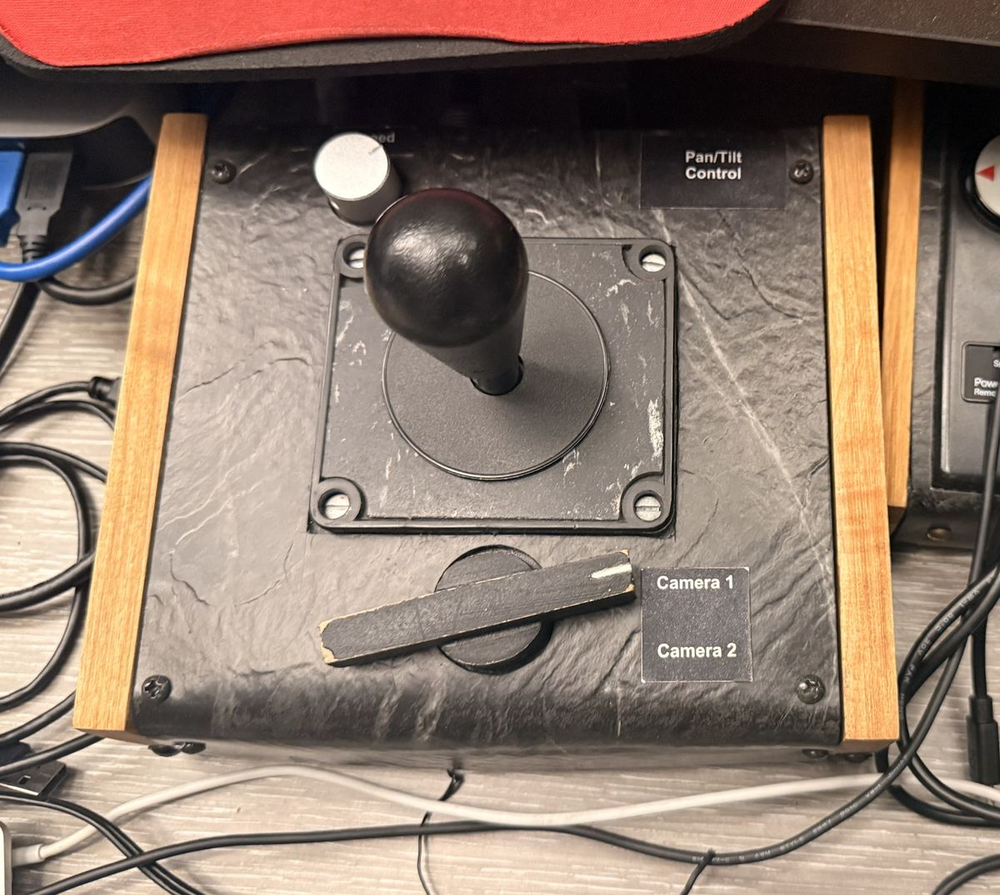
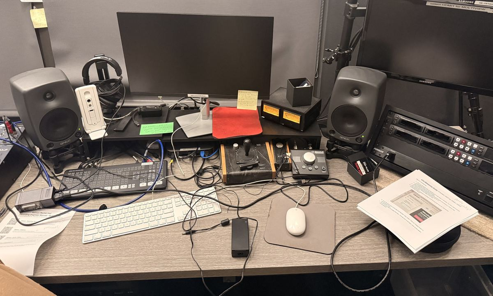

> 🧪 **Status: In Development.** Reorganized with AI assistance from the instructor's own in-class camera notes. The control locations have not been re-checked on the equipment since the rewrite — see **Technical verification** at the bottom.

## 🎚️ Core skill area

**Video Recording** — proper exposure, focus, good color.

## 🌍 Why this matters

You get handed a camera twenty minutes before a recital. It comes out of the cabinet in whatever state the last person left it: wrong white balance, gain cranked up from a dark room, focus stuck in manual. Nobody is going to walk you through the menus.

A student recording engineer has to do two things quickly on **any** body, without a manual:

1. Get the camera back to a known, safe baseline.
2. Change **one** setting deliberately when the room is not ideal — and know what that change costs.

This activity is that drill, repeated on three different cameras so the skill sticks to you rather than to one specific camera.

The same job also gets done by cameras you do **not** carry. BH 209 (Salmon Recital Hall) has its own cameras installed in the room, driven from software rather than from buttons on a body. Part 1 ends with an orientation to those, because the recital you are eventually recording happens in that hall.

## 🎯 What you'll practice

By the end of this activity, you should be able to:

- 📷 Set iris, gain/ISO, shutter, white balance, and focus to a known baseline on the G50, the GH5, and the AX100 — starting from whatever state you found them in.
- 🎬 Demonstrate on video what each of those five settings does to the picture, and say how big each change was in **stops**.
- 💾 Verify your recorded files on a computer and return the camera to the baseline before you put it away.
- 🏛️ Describe how BH 209's installed cameras differ from a camera you carry — what drives them, and where their recording lands.

## 🗝️ Key terms

**stop** · **iris / aperture (f-stop)** · **gain (dB)** · **ISO** · **shutter speed** · **white balance** · **color temperature (K)** · **autofocus (AF)** · **manual focus (MF)** · depth of field · motion blur · noise · **slate** (reading your settings aloud on camera) · **house default**

## 📍 Logistics

**Estimated time:** 25–35 minutes per camera. About 75–110 minutes for all three. You do not have to do all three in one sitting — finish one camera completely, put it away, and come back.

**Where:** The G50 and GH5 live in the white cabinet in **BH 208**. The AX100 lives in the **Standard Gear Kit** (the red backpack) in the same cabinet. You can shoot anywhere with steady light, but you need a computer that reads SD cards before you finish.

**BH 209 (Salmon Recital Hall)** is the other room in this activity. Its cameras are installed in the hall and are not taken anywhere. The door is on a **key code** — most students in this course already have it. If yours does not work, ask rather than propping the door.

**Access:** Can be completed independently on campus. No instructor or TA supervision required once you know where the cabinet is. It cannot be done off campus.

**Group size:** Minimum 1 · ideal 2 · maximum 3. Solo is fine, and solo students get more hands-on time.

**Roles (groups of 2–3):** Rotate at every camera so nobody drives all three bodies.

- **Operator** — the only person touching the camera.
- **Checker** — reads the step aloud, confirms the display shows the right value **before** record is pressed, and keeps track of the lens cap and battery.
- **Slate reader** (groups of 3) — reads the five settings aloud into the microphone while recording.

🔄 **Switch roles** after each camera.

## 🧰 Equipment and materials

Gather all of this **before** you start. If something is missing, you want to know now, not halfway through.

- [ ] Camera body — G50, GH5, or AX100
- [ ] SD card in the camera (check it is actually in there, and that it is not full or locked)
- [ ] For the GH5: a battery from the plastic cylinder labeled **Charged Camera Batteries**
- [ ] For the AX100: the lens cap that comes with the red backpack kit
- [ ] A computer that can read the SD card, plus a reader or adapter if the computer has no SD slot
- [ ] A shooting spot with **something near and something far** in frame — you need both to see depth of field change
- [ ] Steady, unchanging light. Do not do this next to a window with clouds moving past.
- [ ] This page on your phone
- [ ] For the BH 209 orientation only: the door key code, and a fast SD card if you are going to record

## ⚠️ Safety and handling — read this before you touch anything

You are encouraged to experiment with settings. You are **not** meant to discover these the hard way.

- 🚫 **The GH5 has no lens cap. It is lost.** The front glass is exposed at all times. Never set the GH5 down lens-first, never put it in a bag lens-down, and never touch the front element. Carry it lens-up or lens-forward, in two hands.
- 🚫 **Never point any of these cameras at the sun**, or park a long lens on a bright stage spotlight while recording. A sensor can be permanently damaged by this. It does not have to be plugged in for the damage to happen.
- 🔋 **The GH5 needs a battery from the charged cylinder.** Put it in the right way around; it only goes one way. Do not force it, and do not leave a dead battery in the camera for the next person.
- 🎒 **Do not force the G50 lens cover switch** or any card door. If something will not move, it is in the wrong position or the door is latched — stop and look.
- 📼 **Do not reformat the SD card.** There may be somebody else's files on it.
- 🧭 **Change only the five settings in this activity.** These cameras are shared. A stray menu change that you cannot undo costs the next person their shoot.
- 🛑 **BH 209 is different from all of the above.** Everything in this activity's "experiment freely" spirit applies to the handhelds only. The production desk in BH 209 is configured for live recitals — there you change only what a procedure tells you to, and you put it back. See the BH 209 section in Part 1.

## 🎚️ The house default

Every camera in this activity gets returned to the same baseline. Learn this — it is the state a camera should be in when it goes back in the cabinet.

| Setting | House default | Notes |
|---|---|---|
| Iris / aperture | **F4.0** | |
| Gain / ISO | **3 dB** — or **ISO 400** on the GH5 | House numbers for these bodies, not a conversion. See Stops below. |
| Shutter | **1/60** | |
| White balance | **3200 K** | Set as a color temperature, not auto |
| Focus | **Autofocus** | |

> 🚩 You will set the house default twice: once at the start, and once again before the camera goes back in the cabinet.

**Q1 (fill in the blank).** Write the house default from memory before you continue: F______ · ______ dB or ISO ______ · 1/______ · ______ K · ______ focus.

✅ **Answer.** F4.0 · 3 dB (ISO 400 on the GH5) · 1/60 · 3200 K · autofocus.

## 📐 Stops — the one unit that ties this together

The house default is where you start. **Stops** are how you move from it.

A **stop** is a doubling or halving of the light reaching the sensor. Every exposure control on every camera is measured in stops, which is why an engineer can say "give me a stop more" to someone holding a camera they have never touched.

| Control | One stop is… |
|---|---|
| Aperture | One step along the f-number scale: 2.8 · 4 · 5.6 · 8 · 11. **F4.0 → F5.6 is one stop less light.** |
| Shutter | Double or halve the time. **1/60 → 1/30 is one stop more light.** |
| Gain | **6 dB.** 3 dB → 9 dB is one stop more. |
| ISO | **Double it.** ISO 400 → ISO 800 is one stop more. |

Two things worth getting straight now, because they are easy to half-learn:

- It is **6 dB per stop, not 3 dB.** Gain in dB is measured on the amplitude scale, where a doubling is 6 dB.
- **dB and ISO are both gain, but they are not interchangeable numbers.** A camera sitting at 0 dB is at its own base sensitivity, and that base is different on every body. So 3 dB and ISO 400 are the house numbers for these particular cameras — not a conversion you can carry to the next camera you pick up. What always transfers is the stop: **+6 dB and ISO ×2 are the same amount of light on any camera.**

**Q2 (multiple choice).** Your shot is one stop too dark and you are going to fix it with gain alone. You are currently at 3 dB. You set the camera to:

- a) 4 dB
- b) 6 dB
- ✅ c) 9 dB
- d) 12 dB

## 🚀 Get ready

1. Sign out / retrieve the camera from the white cabinet in BH 208. Note where it was so you can put it back the same way.
2. Fit the battery (GH5) or confirm the camera has power.
3. Confirm the SD card is in the camera and has space.
4. Power the camera on and get a picture on the screen. Remove or open the lens cover.
5. Frame your shot: something near, something far, steady light, and stay in that framing for the whole activity so your comparison clips are actually comparable.
6. Decide who is operator, checker, and slate reader.

🚩 **Checkpoint.** You should now see a live picture on the screen before you touch a single exposure control.

## 📷 Part 1 — Find your five controls

Do this section for the camera you are holding. On every body you are looking for the same five things; only the buttons move.

### Canon G50

**Where it lives:** white cabinet, BH 208. Put it back neatly.

| What you want | Where it is |
|---|---|
| Power on | Set the top dial to **Camera** |
| Lens cover | Small switch on the left side — check it is **open** |
| Focus | Physical **AF/MF** button to the left of the display |
| Manual exposure | **[M]** in the upper-left corner of the screen |
| Iris, shutter, gain | **[FUNC]** in the lower-left corner → **IRIS**, **SHTR**, **GAIN** |
| White balance | **[FUNC]** in the lower-left corner → **AWB** or **[K]** color temperature |

To hit the house default you want **[M]** (not auto), then FUNC → IRIS F4.0, SHTR 1/60, GAIN 3 dB, and FUNC → white balance → **[K]** → 3200.

### Panasonic GH5

**Where it lives:** white cabinet, BH 208. Battery from the plastic cylinder labeled **Charged Camera Batteries**.

> ⚠️ Reminder: the GH5 lens cap is lost. The front element is exposed. Handle accordingly.

| What you want | Where it is |
|---|---|
| Power on | Small collar switch on the circular mode dial (top of camera), **Off → On** |
| Video mode | Rotate the top mode dial to the **camera icon with M** next to it |
| Focus | Dial to the right of the viewfinder marked **AF/AE Lock** — toggles **MF**, **AFC**, **AFF/AFS** |
| Manual exposure | **Menu/Set** button in the center of the lower-right dial → top menu → **Exposure Mode** → **M** |
| Iris | Small gear near the shutter button (right index finger) |
| Shutter | Small horizontal gear to the right of autofocus (right thumb) |
| ISO / gain | **ISO** button on top, between **WB** and the **+/-** icons, then the right-thumb gear |
| White balance | **WB** button (upper right, near your index finger), then the right-thumb gear |

The GH5 displays **ISO**, not dB. Its house default is **ISO 400**.

🚩 **Checkpoint.** Before you record anything on the GH5, confirm two separate things: the top dial is on the **M video** position, **and** Exposure Mode in the menu is **M**. Both have to be right or your manual values will not stick.

### Sony AX100

**Where it lives:** the **Standard Gear Kit** (red backpack) in the cabinet in BH 208. Put it back neatly.

| What you want | Where it is |
|---|---|
| Power on | Automatic when you open the screen, or press **Power** |
| Lens cap | Take it off to get a picture. **Keep track of it.** It goes back on before the camera does. |
| Focus | Near the front ring, by the Zeiss logo: set the **Zoom / Focus** switch to **Focus**, then set **AF/MF** to **AF** |
| Manual exposure | All three exposure values are shown along the bottom. Manual means **no "A" and no "E"** next to them. |
| Iris | Tap **Iris**, then adjust with the small ring in front of it |
| Gain / ISO | Tap **Gain/ISO**, then adjust with the same ring |
| Shutter | Tap **Shutter Speed**, then adjust with the same ring |
| White balance | **White Balance** hardware button on the side of the camcorder → **Color Temp** → dial the K value |

### BH 209 — the cameras already in the hall

**Where they live:** installed in **BH 209, Salmon Recital Hall**, and driven from the production
desk. You do not sign these out and you do not carry them. The door is on a key code.

> 🛑 **BH 209 is a production room, not a practice room. The rule here is the opposite of the rest
> of this activity.** On the handhelds you are *encouraged* to push settings around and see what
> breaks — that is the whole drill, and the next person gets a camera you reset. In BH 209 you
> touch only what the procedure tells you to touch, and **everything goes back exactly as you
> found it.** This desk is patched, routed, and levelled for live recitals that are streaming to
> an audience; a stray preset or a moved slider is not your experiment, it is somebody's concert.
> If you are unsure whether you are allowed to change something, the answer is no.

This is the orientation, not the drill. Read it so the room is not unfamiliar the first time you
have to work in it.

| | BH 209's installed cameras |
|---|---|
| The cameras | **AJA RovoCam** — fixed installed cameras, not camcorders. **Two of them, and in practice that is the whole shoot:** one locked-off wide, and a second for an alternate angle. The switcher has eight camera inputs, but a recital here is not an eight-camera production. |
| How you drive them | **AJA RovoControl**, an app on the room's Mac (the one named *BH209-LivestreamAndDanteRecord*), plus a physical **Pan/Tilt joystick** on the desk with a **Camera 1 / Camera 2** selector and its own speed control. |
| Exposure | Real controls, in units you already know: **iris** (f14 → f1.8), **gain** (0 → 33 dB), **shutter speed**, **focus** (10 → 1500 mm), and zoom. An **A / S / M / B** mode selector picks who decides — **M** is full manual, the same idea as `[M]` on the G50. |
| Framing | Up to **16 saved presets**, plus an **ePTZ** tab. Presets are part of the room's setup for a given event — recall them, don't overwrite them. |
| Where the recording lands | Through the **Blackmagic ATEM** switchers to a **disk at the desk** — an SSD, or a fast SD card. There are **two record slots**, a main and a spare, and the multiview reads **NO DISK** when nothing is inserted. |
| Streaming | The same desk streams the program feed to **Vimeo**, with its own on-screen data-rate and cache readout. |
| Audio | The hall gives you **both**: audio embedded with the video, and a separate Dante recording on that same Mac. |
| Getting in | A **key code** on the door, which most students in this course already have. |

**The good news for everything you just practised:** the five settings did not go away, and they
did not change units. An iris is still an iris and 6 dB is still a stop — you reach them through a
window on a screen and a joystick instead of a dial under your thumb. What *is* genuinely
different is that the picture is going somewhere live, and that the card you pull at the end is in
a rack at the desk rather than in your hand.

**Why a locked-off wide is not a lazy choice.** One camera that is correctly exposed, correctly
white-balanced, in focus, and framed to hold the whole ensemble for forty minutes is worth more
than four cameras that drift. Everything this activity drills — get to a known baseline, change one
thing deliberately, know what it cost — is exactly what a static wide demands, because nobody is
going to rescue the shot later by cutting away from it.

> 🧪 **The click-by-click procedure for BH 209 is not written here yet.** The room has its own
> Salmon Recital Hall SOP and quick-start manual, which are being imported. Until that lands,
> treat this section as orientation and do the graded work on the three handhelds. See
> **Technical verification** for exactly what is still open.

**Q3 (multiple choice).** In BH 209 you find a camera preset framed differently from how you would
have framed it. What do you do?

- a) Re-frame it and save over the preset — that's what presets are for
- ✅ b) Leave it. The room is set up for an event, and presets are part of that setup
- c) Delete the preset so nobody uses a bad one
- d) Change it, then change it back from memory afterwards

🚩 **Checkpoint — all three cameras.** Before moving to Part 2, read all five values off the screen out loud: F4.0, 3 dB (ISO 400), 1/60, 3200 K, autofocus. If you cannot find one of them on the display, you are not ready to record yet.

## 🎬 Part 2 — Record the demo clips

Part 2 is the same on all three cameras.

**The rule for every clip:** press record, **read all five settings out loud**, then stop. That spoken slate is what makes the file self-documenting — a year from now you can hear what the camera was set to instead of guessing.

Keep the framing identical across all clips. If the camera moves, your comparisons are worthless.

### Round 1 — the baseline three

| # | Setting | What the clip should show |
|---|---|---|
| 1 | House default, autofocus | A correctly exposed, in-focus shot at F4.0 · 3 dB (ISO 400) · 1/60 · 3200 K |
| 2 | Manual focus, deliberately out of focus | Obviously soft. Make it clearly wrong on purpose. |
| 3 | Autofocus, in focus | Sharp again, and you can hear/see the camera find focus |

🚩 **Stop here and test.** After clip 1, pull the SD card, put it in a computer, and open the file. Does it play? Is there audio? Is your spoken slate audible?

Do not shoot the other nine clips before you know the card is actually recording. Students lose whole sessions this way.

**Q4 (multiple choice).** Why does clip 2 exist at all, if out-of-focus footage is useless?

- a) To fill out the file count
- ✅ b) So you can recognize soft footage on a small camera screen, where it is easy to miss
- c) Because manual focus is always better than autofocus
- d) To test the SD card

### Round 2 — change one thing at a time

Return to the house default before each comparison, then change **only** the one setting listed. Record the "before" and the "after" as separate clips, or as one clip where you change the value on camera — either is fine, as long as the slate is read for each value.

| # | Change | Size | What to look for |
|---|---|---|---|
| 4 | Iris **F4.0 → F5.6** | −1 stop | Depth of field and brightness. Watch the near object against the far one. |
| 5 | Gain **3 dB → 15 dB**, or **ISO 400 → 1600** | +2 stops | Brightness, and grain/noise in the dark parts of the picture |
| 6 | Shutter **1/60 → 1/30** | +1 stop | Brightness, and motion blur — wave a hand through the frame on both |
| 7 | White balance **3200 K → 5000 K** | not exposure | Overall color cast. White balance does not change how much light hits the sensor. |

Clip 5 is deliberately **two** stops so the noise is obvious on a small screen. Say the stop count out loud in your slate along with the values.

**Q5 (multiple choice).** Going from F4.0 to F5.6, the picture gets:

- a) Brighter, with more of the scene in focus
- ✅ b) Darker, with more of the scene in focus
- c) Darker, with less of the scene in focus
- d) Brighter, with less of the scene in focus

**Q6 (multiple choice).** The hall is too dark and your iris is already wide open, so you go from ISO 400 to ISO 1600. How much brighter is that, and what did it cost you?

- a) One stop, and it cost nothing — gain is free
- ✅ b) Two stops, and it cost noise in the shadows
- c) Two stops, and it cost depth of field
- d) Four stops, and it cost focus accuracy

**Q7 (multiple choice).** Dropping the shutter from 1/60 to 1/30 makes the picture brighter. What else changes?

- a) The color gets warmer
- ✅ b) Moving things blur more
- c) Depth of field increases
- d) Nothing else

**Q8 (multiple choice).** The room is lit with roughly 3200 K tungsten light and you set the camera's white balance to 5000 K. The picture will look:

- ✅ a) More orange / warmer
- b) More blue / cooler
- c) Unchanged — white balance only affects stills
- d) Black and white

🚩 **Checkpoint.** Play your comparison clips back on the camera before you leave the room. If you cannot see the difference on the camera screen, you probably changed the framing, the light, or more than one setting at a time. Reshoot it — that is the whole point of the clip.

## ✅ Definition of done

For **each** camera you worked on:

- 🚩 You set the camera to the house default from whatever state you found it in, and confirmed all five values on the display.
- 🚩 Clips 1, 2, and 3 are recorded, with the five settings read aloud on each.
- 🚩 You put the card in a computer and confirmed the files open and play.
- 🚩 Clips 4, 5, 6, and 7 are recorded — one setting changed per comparison, same framing.
- 🚩 The camera is back at the house default and back in the cabinet, with its cap, battery, and bag handled correctly.

Anything below under **Bonus** is optional. Do not spend your session perfecting a shot instead of getting the four comparison clips.

## 🛠️ Troubleshooting

Work in order. Do not skip to the exotic explanation.

**IF the screen is black or there is no picture:**
→ Check the lens cover or lens cap — G50 has a switch on the left, AX100 has a physical cap.
→ Check the camera is powered on and in the right mode (G50 top dial on **Camera**, GH5 top dial on **M video**).
→ Check the battery is seated and charged.
→ Check the iris is not closed all the way down and gain is not at the bottom of its range.

**IF the exposure values will not change:**
→ You are still in an automatic mode. G50: press **[M]**. GH5: top dial on **M video** **and** Exposure Mode = **M** in the menu. AX100: look for the **A** or **E** next to the value along the bottom — if it is there, the camera is still deciding for you.

**IF focus will not go manual (or will not go automatic):**
→ G50: the **AF/MF** button left of the display.
→ GH5: the **AF/AE Lock** collar right of the viewfinder.
→ AX100: check the **Zoom / Focus** switch is on **Focus** first — the AF/MF control does nothing while that switch is on Zoom.

**IF the camera says the card is full, locked, or missing:**
→ Check the card is actually seated. Check the little write-protect slider on the side of the SD card is up.
→ Do **not** reformat. Find a different card or ask.

**IF the file will not open on the computer:**
→ Try a different reader or a different USB port before you assume the file is bad.
→ Check you are opening the video file and not a thumbnail/sidecar file.
→ If one clip is corrupt but others are fine, reshoot that clip and flag the card.

**IF you cannot see any difference between two comparison clips:**
→ Did the framing move? → Did the light change? → Did you actually change the value, or only highlight it without confirming? → Did you change two settings at once?

## ⭐ Bonus / if time allows

Only after the Definition of Done is met.

- **Prove the exposure triangle.** Shoot F4.0 at 1/60, then F5.6 at 1/30. You took one stop away with the iris and handed one stop back with the shutter, so the two clips should be about **equally bright** — but one has more depth of field and more motion blur. Same exposure, different picture. That is the entire reason engineers think in stops.
- Shoot the full white balance range: **2400 K vs 3200 K vs 5000 K** in the same light, and name which one looks correct.
- Push the aperture comparison further — the widest the lens will open vs. the most closed-down it will go — and describe what happens to both depth of field and image sharpness at the extremes.
- Shoot the same subject at 1/60 and a much faster shutter (1/250) and describe when you would actually want that.
- Race it: reset a camera to the house default from a scrambled state, timed, without looking at this page.
- Do all three cameras back to back and write one sentence on which body you would grab if you had five minutes to set up a recital shoot, and why.

## 🧹 Finish, reset, put away

Do not skip this. The next person's session depends on it.

1. Stop recording. Play back at least one file on the camera.
2. **Set the camera back to the house default:** F4.0 · 3 dB (ISO 400) · 1/60 · 3200 K · autofocus.
3. Put the lens cap back on (AX100). Close the lens cover (G50). Keep the capless GH5 lens-up and protected.
4. Take the GH5 battery out and return it — do not leave a drained battery in the camera.
5. Eject the SD card safely from the computer, and put it back in the camera it came from.
6. Put the camera back where you found it. The AX100 goes back in the red **Standard Gear Kit** backpack.
7. Leave the cabinet the way you would want to find it.

🚩 **Final checkpoint.** Before you close the cabinet: is the camera you just used sitting at the house default? Say the five values out loud one more time.

## 💭 Before you leave

Two prompts. Do not write an essay.

- What is **one** thing you want to remember the next time you pick up an unfamiliar camera?
- Which of the five controls took you longest to find, and on which body? That is the one to practice.

## ⚙️ Technical verification

**Last verified:** control locations are transcribed from the instructor's Fall 2026 in-class notes. They were reorganized, not re-checked on the equipment, during this conversion. Confirm on the bodies before treating this page as authoritative.

Specific items to check:

**BH 209 (Salmon Recital Hall) — orientation only, pending the room's own SOP.** What the section
says was confirmed by the instructor and read off photographs of the control surfaces in September
2026. What it does *not* yet contain is a procedure, because the room's Salmon Recital Hall SOP and
quick-start manual are still being imported. Full intake notes, including everything read off the
screens, are in `content/activities/_source/bh209-cameras.md`. Still open:

- **White balance.** Iris, gain, shutter, focus, and zoom are all on RovoControl's Camera Control
  tab in familiar units, so the stops lesson transfers. White balance is *not* on that tab —
  confirm whether it lives under **Settings** or is not exposed at all, and adjust the section.
- **How many cameras, and which inputs they are.** RovoControl shows two camera buttons; the
  switcher multiview has eight. Which are RovoCams, and do this activity's handhelds plug into the
  same switcher? If they do, the two halves of this activity are one job and should say so.
- **The recording media and the slots.** The desk checklist names an SSD or a fast 1667x Lexar SD,
  a main slot and a spare in the top right. Confirm which is which on the hardware, and whether a
  student brings a card or uses the room's.
- **The data-transfer procedure.** Still wanted, still unwritten: which disk, which computer, where
  files go, and how a student confirms the take is good before handing the room over.
- **The separate audio feed.** The room Mac is named `BH209-LivestreamAndDanteRecord`, so Dante
  recording happens there. Confirm what feeds it and whether starting it is its own action. This
  also unblocks the Stereo Recording activity.
- **The key code and the room's stored passwords** stay out of this repo, which is public. The page
  says to ask; confirm who a student should ask.
- **Not a page problem, but worth knowing:** macOS warns that the installed AJA RovoControl is an
  Intel-only build that "will not open in a future release of macOS." The room loses camera control
  the day that Mac updates past it.

Portable cameras:

- **dB, ISO, and stops — resolved.** 6 dB is one stop and doubling ISO is one stop; both are definitional and safe to teach as written. What stays body-specific is which ISO a given camera's 0 dB sits at, so the house numbers (3 dB, ISO 400) should be confirmed on each body rather than converted between. The original notes treated 3 dB and ISO 400 as the same value, and paired 3 → 9 dB with ISO 400 → 1600; those are one stop and two stops respectively. The comparison is corrected here to two stops in both units.
- **Gain range and step size.** Confirm each body actually reaches 15 dB / ISO 1600 and steps in 3 dB increments. If a body steps differently, keep the **+2 stops** instruction and adjust the numbers.
- **GH5 units.** The GH5 shows ISO, not dB, so its house default is written here as ISO 400.
- **GH5 white balance.** Reaching a specific Kelvin value may require selecting the **K** color-temperature preset before dialing the number. Confirm the exact button sequence on the body.
- **GH5 lens cap.** Confirmed lost as of the original notes. Confirm whether it has since been replaced, and update this page if so.
- **GH5 focus dial labels.** The original notes list **MF**, **AFC**, and **AFF/AFC**; the third is written here as **AFF/AFS**. Confirm the actual markings.
- **AX100 gain labeling.** Confirm whether the button reads **Gain/ISO** and which unit it displays by default.
- **Slower shutter example.** The example value in the original notes was cut off mid-sentence. **1/30** is used here as the slower-shutter comparison. Confirm that is the intended value.
- **Full model designations.** Canon VIXIA HF G50, Panasonic Lumix GH5, and Sony FDR-AX100 are inferred from the short names in the original notes. Confirm against the body labels.
- **Battery return location.** The notes name a **Charged Camera Batteries** cylinder for taking batteries but do not name where used batteries go. Confirm and add it to the cleanup steps.

## 🤖 AI use disclosure

Based on an existing instructor-authored activity (the Fall 2026 portable cameras notes) and reorganized with AI assistance into the standard MUS 248 activity structure. The BH 209 orientation was written in September 2026 from the instructor's answers about the hall; it deliberately stops at what was confirmed, and what it does not cover is itemized under Technical verification rather than filled in. The camera control details come from the instructor's notes. The stop relationships (6 dB per stop, ISO doubling per stop) were corrected by the instructor in September 2026, and the gain comparison was rebuilt around them. The structure, checkpoints, troubleshooting, and questions were AI-drafted and are pending instructor review.
