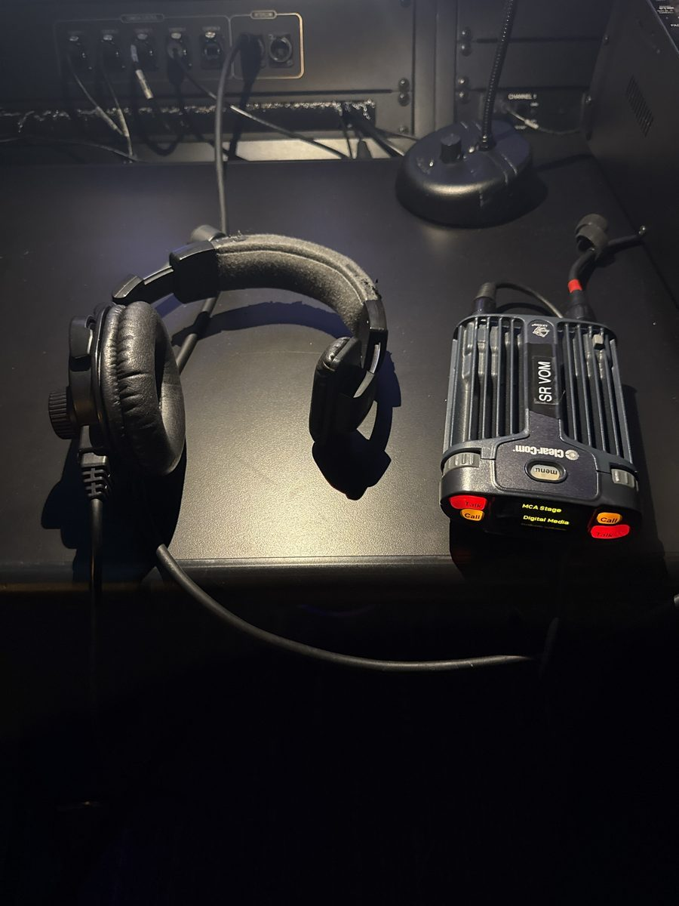
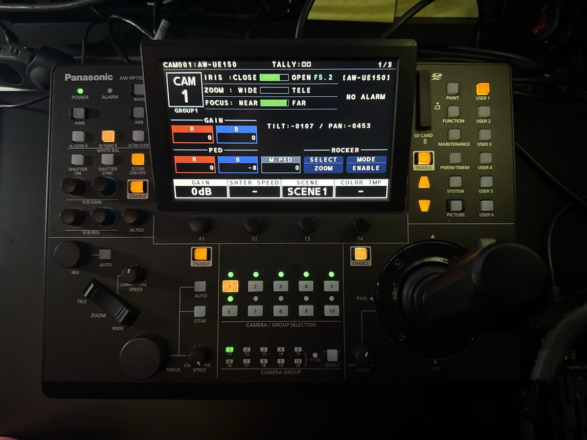
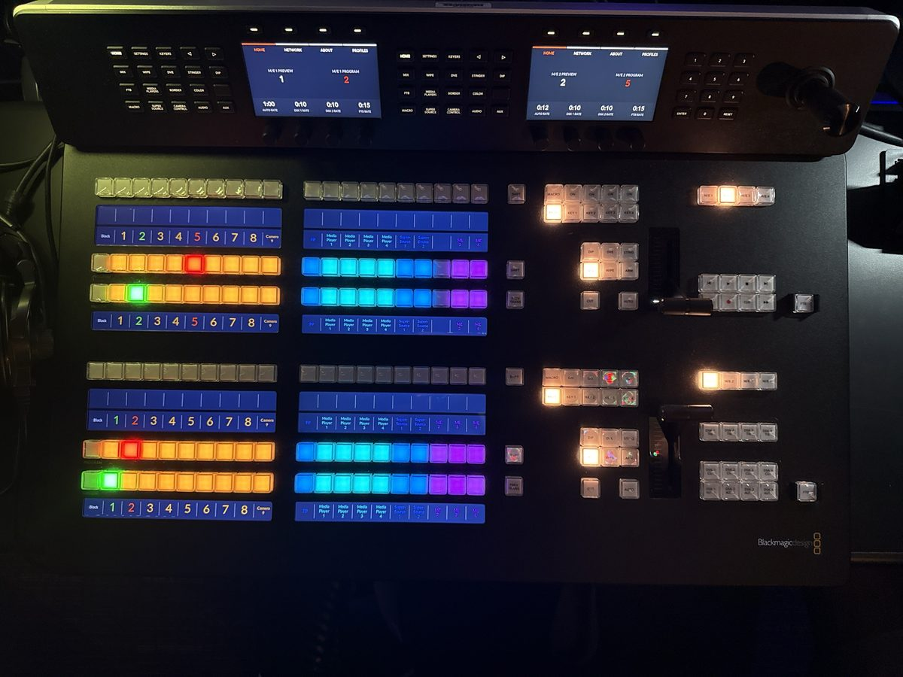

> 🧪 **Status: In Development.** Drafted from the instructor's dictated walkthrough and photos of
> the Musco booth, plus a dictated training session at the switcher and camera controllers
> (October 2026). See **Technical verification** for what's still open.

## 🎚️ What this is

The field checklist for a gig at **Musco Center for the Arts**. It works like the **Salmon Gig
Checklist** — every line is something you do or check — but the room is different in three ways:

- **You bring the backup recording with you** and set it up in the booth.
- **You work alongside the Musco crew.** Seiyua, the Musco video tech, runs the recorders in the
  rack; lighting is someone else's board. Anything that needs another person comes first.
- **It's a live multicam edit.** Remote-controlled cameras, a switcher, and a crew on headsets —
  and every camera has to match.

## 🗝️ Key terms

**static wide** · **program** · **preview** · **multiview** · **cut** · **white balance** ·
**gain** · **pedestal** · **brightest cue** · **calling shots** · **board feed**

## 👔 Dress code

- 🚩 Wear **all black**, head to toe.
- 🚩 Wear **closed-toed shoes**.

Same as every gig, Salmon included — you're visible from the house and backstage.

## 👥 Roles

- **Switcher operator** — the main video edit. Runs the ATEM switcher, decides what's on program,
  and **calls shots** to the camera operators over headset.
- **Camera operators** — one per Panasonic camera controller (there are two). Find and frame the
  shots the switcher operator calls.
- **Seiyua (Musco video tech)** — Musco staff. Loads your SSDs into the Blackmagic recorders in
  the rack, starts and stops them, and checks their remaining space.

The backup recording (AX100 + H4n) sits in the booth next to you; whoever is free keeps an eye on
it.

## 🧰 Equipment and materials

Pack this in BH 208/209 before you leave.

- [ ] The **black backpack with the red stripes** — the Standard Gear Kit — with the **Sony
  AX100** inside
- [ ] The **AX100 power cable** — don't count on the battery for a full concert
- [ ] **Zoom H4n** — the backup audio recorder. (The Zoom F8 also lives in the Standard Gear Kit;
  you only need **one** backup recorder, so if the H4n is going, the F8 isn't needed.)
- [ ] **Fresh AA batteries for the H4n** — rechargeables are fine. It takes two; bring **four**,
  in case some turn out to be dead.
- [ ] **Clean SD cards**: the **128 GB** for the AX100, plus a smaller one for the H4n
- [ ] **One tripod** for the AX100 — confirm the **plate on the AX100 matches this tripod** before
  you leave
- [ ] **One light stand** with a screw adapter, for the H4n
- [ ] **Three SSDs** — one each for the static wide, the program feed, and the conductor cam
- [ ] **Headphones** with a **¼-inch adapter**

## 🚗 Pre-arrival

- 🚩 Check for unfinished business from the last gig — cards or SSDs that still need cleaning, or
  a data transfer that never got finished. Finish that first.
- 🚩 Dressed per the **Dress code**.
- 🚩 If you're going to be late, text your fellow engineers before your call time.

**Q1 (short answer).** Call time: ______ · Concert: ______ · Arrival time: ______

✅ **Answer.** There's no fixed answer — write in tonight's call time, tonight's concert, and when
you actually got there. It's a log entry, not a test.

## 🚪 Arrival

- 🚩 Walk the gear over to Musco.
- 🚩 Go in through the **stage door** and **sign in**.
- 🚩 Make your way around to **front of house** — the booth at the back of the house.
- 🚩 Get on **headset**. It's a Clear-Com beltpack with two channels: **MCA Stage** and **Digital
  Media**.

## 🙋 First: the things that need other people

Other people's time is the bottleneck — do these before anything you can do on your own.

- 🚩 Ask for **concert lighting**, including the **brightest cue** of the night. You set exposure
  against the real light, not work lights — and the brightest cue is the one most likely to blow
  out.
- 🚩 Hand the **three SSDs** to Seiyua, and ask him **which recorder is which**: the **static
  wide**, the **program** (the multicam edit), and the **conductor cam**. He checks their remaining
  recording time.
- 🚩 Check the **board feed** — that the audio from the board is reaching the recordings.
- 🚩 Ask Seiyua for the **audio as a separate file** after the show. The audio embedded in the
  video is usually fine, but ask anyway.
- 🚩 Decide **who's on the switcher** and **who's on which camera controller**.
- 🚩 Grab **two copies of the program**.

## 🎙️ Backup recording — in the booth

The AX100 and H4n go **back of house, center**, right next to front of house — in the booth,
basically.

**AX100 (backup wide)**

- 🚩 Mount the AX100 on its tripod. Center it on the stage, and check it's level — not tilted, not
  rotated.
- 🚩 Frame the AX100 **wide**. Nobody operates this camera once it's rolling.
- 🚩 Plug the AX100 into AC power.
- 🚩 Insert the clean **128 GB** SD card into the AX100.
- 🚩 Confirm on the AX100's display: several hours of remaining recording time, and **no battery icon** —
  that's how you know it's running on AC.

**Zoom H4n (backup audio)**

- 🚩 Fresh AA batteries in the H4n.
- 🚩 Clean SD card in the H4n.
- 🚩 Mount the H4n on the light stand.
- 🚩 Headphones into the H4n (¼-inch adapter): **check the backup recording** and confirm the
  signal is clean.

## 🎨 Camera matching — house defaults

Several cameras cut together. If one is brighter, or bluer, than the next, every cut shows it.
Start every camera from the same **house defaults**:

| Setting | House default |
|---|---|
| Iris | **F5.6** |
| Gain | **0 dB** |
| Shutter | default |
| White balance | **A / 3200K** — not B / 5600K. Hold **A/3200K** down for a few seconds. |
| R/B gain | **R 0 · B 0** |
| R/B pedestal | **R 0 · B 0** |

- 🚩 Select a camera with its **camera button** — it lights **yellow** — then check its values on
  the controller's screen and set anything that's off.
- 🚩 Repeat for every camera you're responsible for.
- 🚩 Compare them side by side on the multiview, under the brightest cue. They should look like
  one room.

**Two different "gains."** The **R/B GAIN** knobs shift the color — red and blue — and belong to
white balance. **GAIN** (in dB, on the screen) brightens the whole picture electronically, and the
more you add, the noisier it gets. Different controls; both have a house default.

This photo is a real example of a camera that's **off** the house defaults: iris **F5.2** (not
F5.6) and blue pedestal **−8** (not 0).

**Q2 (fill in the blank).** On the camera controller, you select camera 2 by pressing the
______________ button. When it's selected, it lights ______.

✅ **Answer.** The **camera 2** button (in the Camera / Group Selection row); it lights
**yellow**.

**Q3 (multiple choice).** Which white balance preset is the house default at Musco?

- ✅ a) A / 3200K
- b) B / 5600K
- c) AWB (auto white balance)
- d) Whatever the camera was left on

**Q4 (multiple choice).** On the controller's screen, the **GAIN** value (in dB) goes up. What
happens to the picture?

- a) It gets bluer
- ✅ b) It gets brighter, and noisier
- c) It zooms in
- d) Nothing — gain only affects audio

**Q5 (short answer).** Camera 1's screen reads: iris **F5.2**, gain **0 dB**, R/B gain **R 0 · B
0**, R/B pedestal **R 0 · B −8**. Which two values are off the house defaults, and what should each
be?

✅ **Answer.** Iris is **F5.2** — should be **F5.6**. Blue pedestal is **−8** — should be **0**.

## 🕹️ Camera controls

All the cameras are remote-controlled, pan-tilt-zoom cameras. You run them from a Panasonic
controller.

- 🚩 **Pick your camera** with its camera button — whichever is lit **yellow** is the one you're
  controlling. Check before you move anything.
- 🚩 **Camera 3 is the static wide. Never touch it.** It's framed wide enough that people standing
  for a bow are still in it.
- 🚩 **Joystick** — pan and tilt. It works like an airplane: forward and back are reversed (push
  forward to tilt down); left and right are normal.
- 🚩 **Zoom rocker** — the controller labels its two ends **TELE** (zoom in) and **WIDE** (zoom
  out). Go by the labels. The **speed** knob next to it sets how fast the zoom moves.
- 🚩 **Focus** — if a shot goes soft, turn **AUTO** focus on, let it find focus, then turn
  **AUTO** off again so it doesn't wander mid-shot. Or focus by hand with the **focus** knob.

**Q6 (multiple choice).** A shot has gone out of focus. What's the quick fix?

- a) Leave auto focus on for the rest of the show
- ✅ b) Turn AUTO focus on, let it focus, then turn it off
- c) Zoom all the way out
- d) Ask the switcher operator to cut to camera 3 and leave it there

## 🎯 Practice cameras

Before the house opens, practice until moves are smooth — a jerky zoom on program is worse than no
zoom.

- 🚩 Zoom in and out **smoothly**, at a steady speed. Try a few speed settings.
- 🚩 Switcher operator calls practice shots — "**focus on the ____**," "**zoom out to the whole
  ____ section**" — and the camera operator finds, frames, and focuses them.
- 🚩 Swap roles if there's time.

## 🎬 The switcher

The switcher is a **Blackmagic ATEM Constellation 8K**. **Program** is the main video — what's
being recorded and what everyone's seeing. **Preview** is the shot you're thinking about putting
up next.

- 🚩 The **top row (red) is program**. **Never press the program row** — whatever you press there
  goes straight into the recording.
- 🚩 The row below it **(green) is preview**. Pick your next shot there, check it on the multiview,
  then take it to program with **CUT** (instant), **AUTO** (runs the transition at a set rate), or
  the **lever** (runs the transition by hand).
- 🚩 Transitions: **MIX** is a plain fade. **DIP** and **WIPE** (a half-and-half split) work too.
  **DVE** works, but isn't recommended. **STING** and **ARM** don't do anything right now.
- 🚩 **Black** gives you a black screen.

**The pattern:** the **static wide is the safe shot** — open the show on it and end on it. In
between, find the interesting things, and try to catch the solos. **The switcher operator calls the
shots** over headset — "camera 2, get the trumpet solo" — and the camera operators find them.

**Setting up the multiview:** in **ATEM Software Control** on the booth computer, click the **gear
icon** (lower left) → **Settings** → **Multi View** tab → pick **Multi View 1–4**. Each box has a
dropdown that sets its source.

**Q7 (multiple choice).** You want to put camera 4 on screen next. Where do you press 4 first?

- a) The program row
- ✅ b) The preview row
- c) Either — they do the same thing
- d) The Black button

**Q8 (short answer).** Which shot opens the show and closes it, and why that one?

✅ **Answer.** The **static wide** (camera 3). It never moves, so it's always safe — everyone's in
it, including bows.

## ▶️ Start recording

- 🚩 Confirm with Seiyua that the **rack recorders** are rolling — he starts them.
- 🚩 Start the **AX100**.
- 🚩 Start the **H4n**.
- 🚩 Confirm every recorder you started is **actually rolling** — numbers moving, not just a button
  pressed.
- 🚩 Switcher on the **static wide** for the top of the show.

## ⏸️ Intermission

- 🚩 Default: leave everything recording straight through.
- 🚩 Check remaining recording time and battery life on the **AX100** and **H4n**.

## 🏁 End of show

- 🚩 Switcher ends on the **static wide**.
- 🚩 Stop the **AX100** and the **H4n**.
- 🚩 Pick up the **three SSDs** from Seiyua — **the same night**.
- 🚩 Get the **separate audio file** from him, if he has one.
- 🚩 Pack everything you brought, and carry it back to BH 208/209.

## 💾 Data transfer

Same procedure as the **Salmon Gig Checklist** — two drives, `YYMMDD Full Event Name` folders,
`From [source name]` subfolders, and the **Triple Triple Check** before anything gets wiped.

Tonight's sources:

- the **three SSDs** (static wide, program, conductor cam)
- the **AX100**'s SD card
- the **H4n**'s SD card
- the separate audio from Seiyua, if you got it
- the program

You check your own copies, and you wipe the cards and SSDs yourself to make space for the next
gig — that's the engineer's job. If anything doesn't match, or you're only 99% sure, don't delete;
ask for help.

## ✅ Definition of done

- 🚩 The show is recorded on the rack recorders (static wide, program, conductor cam), the AX100,
  and the H4n.
- 🚩 The three SSDs came back with you the same night.
- 🚩 Files are copied to **both** the Post and Backups drives and passed the Triple Triple Check
  before any card or SSD was wiped.
- 🚩 Everything you brought is back in BH 208/209.

## ⚙️ Technical verification

**Confirmed by the instructor:**

- Roles (switcher operator calls shots; two camera operators; Seiyua runs the rack recorders and
  checks their space), the arrival order, the dress code, and the priority on things that need
  other people.
- House defaults: F5.6, 0 dB, A / 3200K, R/B gain 0/0, R/B pedestal 0/0.
- Only one backup recorder is needed — the H4n; the F8 just lives in the Standard Gear Kit.
- AX100 is a standalone backup wide; it and the H4n go in the booth, back of house center.
- SSDs come back from Seiyua the same night; engineers do the data pass and wipe cards themselves.
- Quick focus fix: AUTO focus on, then off.

**Read from photos, not checked in person:**

- Controller: Panasonic **AW-RP150**; camera **AW-UE150**. Switcher: **ATEM Constellation 8K**
  (from ATEM Software Control's title bar), with a two-row (two M/E) control panel. Comms:
  Clear-Com beltpack, channels MCA Stage and Digital Media.

**Still open:**

- **Zoom direction.** In training, the top of the rocker was described as zoom *out*; the
  controller's printed labels put **TELE** (zoom in) at the top and **WIDE** at the bottom. This
  page says "go by the labels" until someone confirms it at the controller.
- **Shutter "default."** Is that SHUTTER ON left off, or a specific speed?
- **Holding A/3200K for a few seconds** — what the hold does (commit the preset? run a white
  balance?).
- **Camera 3 and the house defaults** — "never touch camera 3" is clear for framing. Does it still
  get the house exposure/color settings, or is it left alone entirely?
- **Which M/E row** on the two-row switcher panel is the program that gets recorded.
- **The light stand's screw adapter thread** — dictated as "1/8 inch," which isn't a standard
  mounting thread (¼"-20 is the camera thread; ⅝"-27 is the usual light/mic stand stud). Confirm
  the real part.
- **Which smaller SD card** (8 GB or 32 GB) goes in the H4n.
- **Board feed** — what exactly gets checked, and where.
- **Call time** relative to downbeat, and when recording starts (Salmon uses 3 minutes before).
- **Which multiview goes to which monitor**, and whether it has to be set up each gig.
- **Headsets and sign-out** at the end of the night — who collects headsets, and whether you sign
  out at the stage door.

## 🤖 AI use disclosure

Drafted by AI from the instructor's dictated walkthrough, a dictated training session at the
switcher and camera controllers, the instructor's answers to follow-up questions, and photos of the
Musco booth (camera controller, switcher, headset). The training dictation's explanation of gain
mixed up R/B gain and master gain; this page separates them. Where the dictation and the
controller's printed labels disagree (zoom direction), the page follows the labels and lists the
conflict above. Student names from the training session were left out. Pending instructor review.
