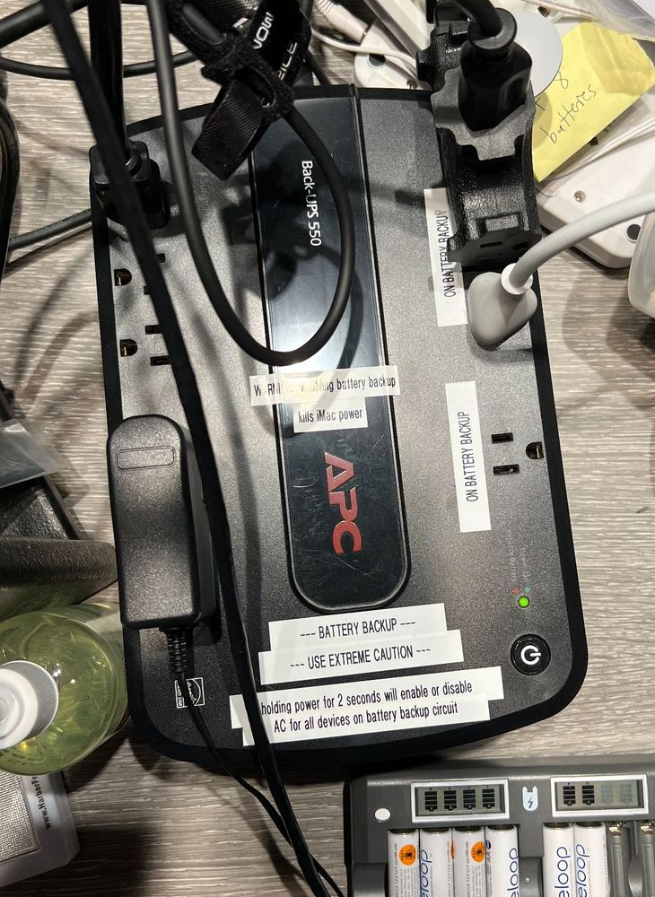
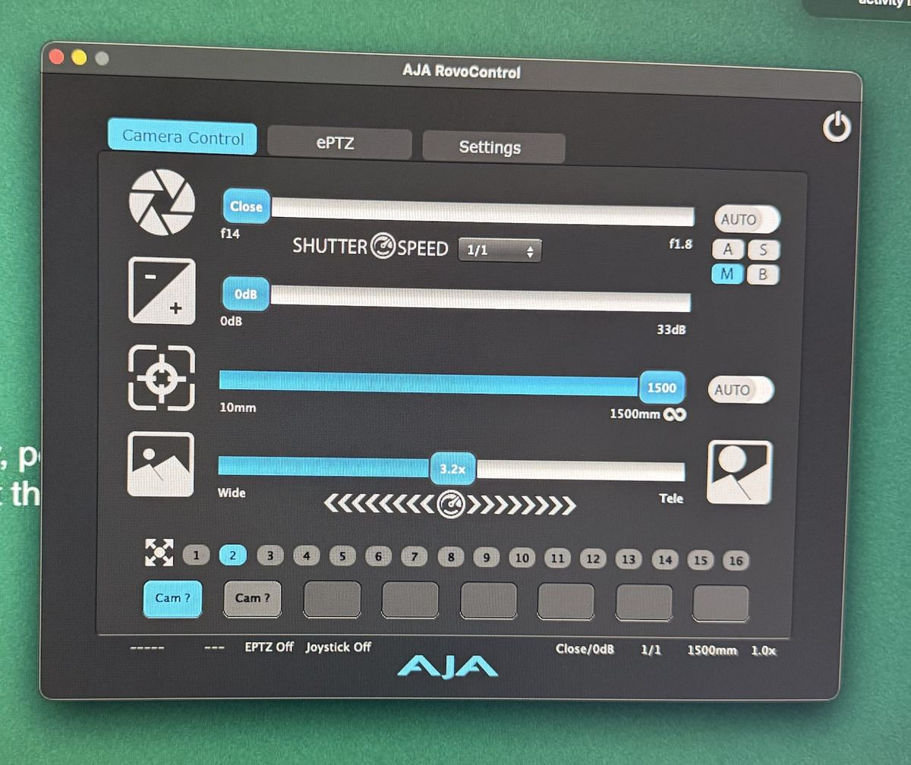
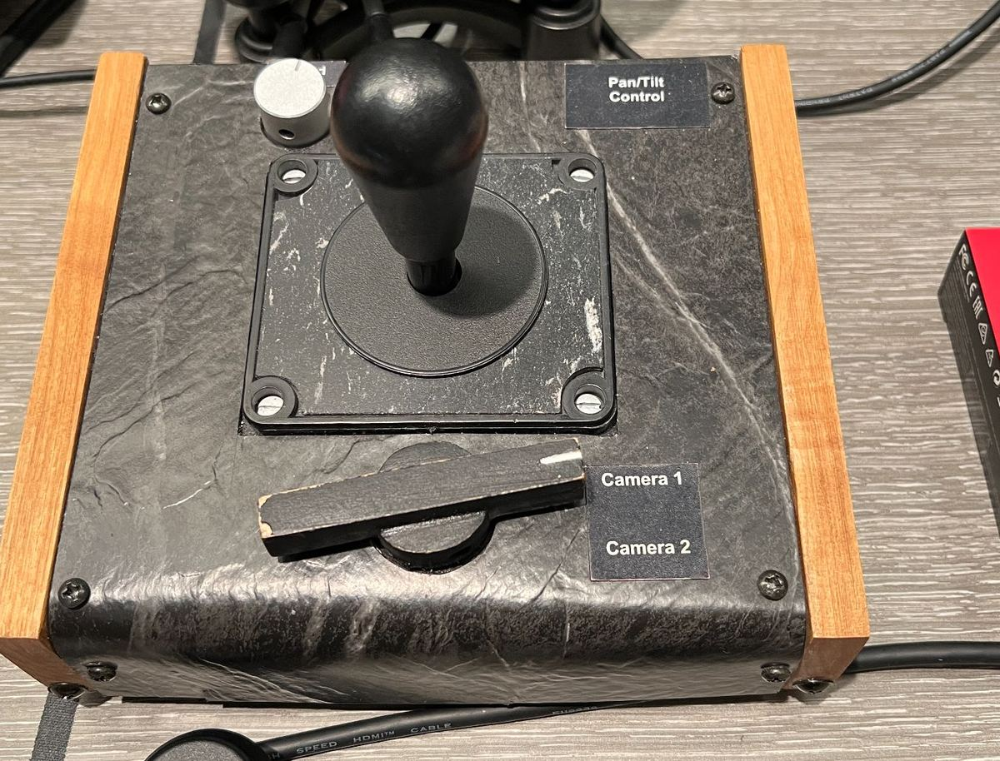

> 🧪 **Status: In Development.** Built from the instructor's *Salmon Checklist & S.O.P.* (last
> revised September 2025), corrected and restructured in September 2026 around the room's actual
> current gear. Most of the room is confirmed here. A few specifics — exact F8 input routing, and
> the ATEM HyperDeck's own record button — are still open. See **Technical verification**.

## 🎚️ Core skill area

**Video Capture**, **Audio Capture**, and **Data Management** — the basic single-camera capture
that covers most gigs in this room, start to finish, including getting the files somewhere safe
afterward.

## 🌍 Why this matters

Most of the recording gigs in this program happen in Salmon Recital Hall. This is the routine
version — one video chain, two independent audio chains, no switcher-fed multicam, no livestream.
Get comfortable here first; the other Salmon activities build on top of it.

A recital happens once. There is no second take, no "can we run that again", and no version of the
evening where you get to explain that the card was full. The engineer's entire value is doing the
boring things in the right order, early, and then watching.

> 🛑 **This is a production room, not a practice room.** In the Portable Cameras activity you are
> encouraged to push settings around and see what breaks. Here you change only what the procedure
> names, and you put everything back. The desk is patched, routed, and set for live recitals — a
> stray fader or a moved preset is somebody's concert, not your experiment. **If you are unsure
> whether you are allowed to change something, the answer is no.**

## 🎯 What you'll practice

- 📋 Run the actual order of operations — power, media, framing, both audio chains, video, a short
  recording, and a clean stop — the same order you would use on a real gig, compressed to
  20–45 minutes.
- 🎚️ Get clean levels on two independent audio recorders and verify them by listening, not by
  assuming.
- 🎥 Frame a primary wide shot correctly, and know when you have to redo it, and when to leave it
  alone.
- 💾 Get the files off the cards and onto two drives, named so somebody else can find them, and
  prove — not assume — that it's safe to wipe the cards after.
- 🤝 Hand the room back in the state you would want to find it.

## 🗝️ Key terms

**primary wide** · **backup wide** · **redundancy** · **program feed** · **board feed** ·
**switcher** · **multitrack** · **dual-channel recording** · **ISO recording** · **gain / ISO** ·
**preset** · **transcode** · downbeat · encore

## 📍 Logistics

**Time:** running this procedure once — audio, video, a short test recording, and the data pass —
takes about **20–45 minutes**. On an actual gig, budget the whole evening and arrive **1 hour
before downbeat**; if it's your first gig, arrive **90 minutes before**.

**Where:** the control room is **BH 208/209**; the hall is below.

**Access:** BH 208/209 is on individual student key-card access — you either have it or you don't.
If your card doesn't work, talk to Borecki rather than propping the door.

**Group size:** 1–3 people. Most real gigs assign two engineers, but you should be comfortable
running this solo after your first time through.

## 🧰 Equipment and materials

- [ ] The **AX100** and its tripod, from the standard gear kit (red backpack) in BH 208/209 — the
  kit has its own checklist inside, an inventory of everything that's supposed to be in the kit;
  use it to make sure nothing's missing
- [ ] AC for the AX100, **plus a charged battery** as backup power — always used on a real gig; in
  this activity it's a bonus step, see below
- [ ] A clean **SATA SSD** for the HyperDeck
- [ ] A clean **32 GB SD card** for the Zoom F8
- [ ] A clean **8 GB SD card** for the Zoom H6
- [ ] A clean **128 GB SD card** for the AX100 backup wide — always used on a real gig; in this
  activity it's a bonus step, see below
- [ ] The program, once you can get hold of it

## ⚠️ Before you touch anything

- 🔌 **The battery backup under the desk feeds more than you'd guess.** It powers the retired
  "Salmon Audio Rec" Mac Mini — but it also powers the **Zoom F8 and the Zoom H6**. Holding its
  power button for two seconds enables or disables AC for everything on that circuit. Mid-concert,
  disabling it doesn't just kill an unused Mac, it kills both of your audio recorders. Both the F8
  and the H6 also take their own batteries, so they don't strictly depend on this circuit — but
  that doesn't make powering them up (and back down at the end) any less of a real step. Don't
  assume either one is already on, or already off. Read the label before you touch the backup.
- 🏷️ **Read the labels.** Somebody has already taped down the answer to most questions you will
  have, including which HDMI feeds the multiview.
- 🖥️ **There is more than one Mac in this room.** Check which machine you are on before you start
  clicking. They do different jobs.
- 🚫 **Do not adjust the audio preamps.** The gain structure is set. If you think a level is
  genuinely wrong, that's not something to fix by ear — notify Borecki.
- 🙋 **Ask.** The recital manager, the performer, and your supervisor all know things the procedure
  cannot. "Is there an encore?" has saved more recordings than any setting.

## 🗂️ This activity, start to finish

This is the same order you'd use on a real gig, run once, fast, on a short test "recital" — someone
plays or talks for under a minute so you have something to check afterward.

1. **Power up.** Battery backup, the Zoom F8, the Zoom H6 (fresh batteries or AC), the ATEM Master.
2. **Load media.** A clean 32 GB card in the F8, a clean 8 GB card in the H6, a clean SATA SSD in
   the HyperDeck.
3. **Frame the primary wide.** Zoom in **RovoControl** on the computer, pan and tilt on the
   **joystick**. Leave gain and f-stop where they are preset — see **Framing and exposure** below.
4. **Set up the F8.** Power is the switch at the lower right of the unit; the SD card slot is on
   the side. For this pass, that's it — power on, card in, hit record when it's time. (More detail
   on exact input routing is coming — see **Technical verification**.)
5. **Set up the H6.** Fresh batteries, XLRs connected (Green: Left, Red: Right).
6. **Listen before you trust either recorder.** Headphones on, check both sides, confirm it's
   actually stereo and not the same signal twice.
7. 🎁 **Bonus, if the AX100 is free:** it's shared with the Portable Cameras activity, so only do
   this if nobody else has it out. If time allows and the hall is open, carry the AX100 down,
   mount it on its tripod inside the hall, and run a real test recording. If you're short on time
   or the hall isn't accessible, it's fine to test it from inside the booth instead.
8. **Start main audio (F8), start backup audio (H6), start video (primary wide).** Let it run for
   under a minute.
9. **Stop everything**, and check that each recorder actually has a file, not just that you pressed
   the button.
10. **Do the data pass.** See **Data management** below — this is not optional practice, it's the
    other half of the job.

🚩 **Checkpoint.** Before you power anything on, you know the order you're about to do this in.
Early on, keep this page open or write the order down; after you've run it enough times you'll be
able to do it from memory, but it's always worth a quick double-check before an audience is in the
room.

## 🎥 Redundancy, on purpose

On a real gig, audio is always captured **twice**, on two chains that share no equipment:

| | Main | Backup |
|---|---|---|
| Device | **Zoom F8** | **Zoom H6** |
| Role | multitrack capture of the patched inputs | independent stereo capture |
| Lands on | its own SD card | its own SD card |

Video works the same way in principle — a primary wide through the switcher, and an independent
backup wide on its own card, so that one dead disk, one pulled cable, or one wrong button can't
take out both copies. In this activity, the backup wide (the AX100) is the bonus step above,
shared with the Portable Cameras activity; on a real gig it isn't optional.

| | Primary | Backup |
|---|---|---|
| Camera | **AJA RovoCam**, installed in the hall | **Sony AX100** camcorder, on a tripod |
| Path | into the **ATEM** switcher | nothing — straight to its own card |
| Lands on | **SATA SSD** in the HyperDeck | **128 GB SD** in the camera |

The backup wide is deliberately kept off the switcher — the source SOP says *"ensure that the HDMI
is not plugged into the ATEM Extreme"* — so a single point of failure in the switcher chain can't
destroy both copies. That design happens to line up with a real limitation too: the AX100 can't
output live HDMI at the same time it's recording internally in 4K. But the reason it's built this
way is redundancy, not that limitation.

**Q1 (multiple choice).** Why is the backup wide deliberately *not* run through the switcher?

- a) The switcher has no spare inputs
- b) Its picture quality is too low to mix with the others
- ✅ c) So that a single failure in the switcher chain cannot destroy both recordings
- d) Because the AX100's HDMI output doesn't work at all

**A third layer, inside the F8 itself.** Each input the F8 records can come in **twice at once** —
a "hot" level for normal use, and a lower "safe" level as a backstop. That's **dual-channel
recording**, and it's built into the mic splitter, not something you configure. If a loud passage
clips the hot level, the safe level still has usable signal.

**Q2 (multiple choice).** The F8 can record an input twice at once, at two different levels. What's
that for?

- a) To create a stereo effect from a single mono mic
- ✅ b) So a loud passage that clips the "hot" level still has clean signal on the lower "safe" level
- c) To double the file count for easier backup
- d) It's required for the Post drive's naming convention

🚩 **Checkpoint.** Whichever chains you're running today have clean, empty media in them before you
start. "NO DISK" on the multiview means exactly what it says.

## 📷 Framing and exposure

**You adjust framing, not exposure.** Zoom, pan, and tilt are yours to set — zoom in **RovoControl**
on the computer, pan and tilt on the **joystick**. Gain and f-stop are preset for the hall and you
leave them alone, because the lighting here doesn't change from gig to gig.

**Framing isn't a set-it-and-forget-it, pre-show task — but it isn't a live adjustment either.**
Redo it between pieces, in the pause before the next one starts, especially when the ensemble on
stage changes size — a soloist, then a trio, then a full ensemble. Once a piece has started, leave
it alone. And when you do reframe, err **slightly wide** rather than perfectly tight: a little
extra room at the edges is fine, a performer's elbow cut off by the frame isn't.

**Q3 (multiple choice).** When should you adjust the primary wide's framing?

- a) Continuously, throughout each piece, following the soloist
- ✅ b) Between pieces only — reframe if needed, then leave it alone once the piece starts
- c) Only once, before the very first piece of the night
- d) Whenever the switcher operator asks for a new angle

> 🚩 **The exception, and why you still need the stops.** Occasionally a piece is staged in low
> light — a candlelit set, a dimmed ballad. Rare, but it happens, and then the preset is wrong and
> **you** have to fix it in the moment. If it's too dark, you boost gain and open the iris, and
> that's the entire point of the Portable Cameras drill: you should be able to say "that's two
> stops down, I'll take one back on the iris and one on gain, and the gain will cost me noise in
> the shadows" without stopping to think. Deviate knowingly, note what you changed, and put it back
> afterwards.

**The shot itself** is the same instruction and it's worth quoting exactly: *"as close as possible,
BUT wide enough to have enough space on edges while standing to bow."* Performers stand up. They
bow. They gesture at the accompanist. Frame for that, not for the seated position you can see right
now.

**Q4 (fill in the blank).** Write the framing rule in your own words, in one sentence, without
looking: ________________________________________________

✅ **Answer.** As tight as you can get while still leaving room at the edges for a performer
standing up and bowing.

If you're doing the bonus AX100 step, it has its own settings for this hall:

| AX100 in Salmon | Value |
|---|---|
| Iris · gain · shutter | **F4 · 3 dB · 1/60** |
| White balance | **3800 K, A5 G2**, Soft High Key |
| Image size | **XAVC S 4K** |

**Q5 (multiple choice).** The Portable Cameras house default is 3200 K, and Salmon runs 3800 K.
Which is wrong?

- a) The house default — it should be updated to 3800 K
- b) Salmon — the cameras should match the house default
- ✅ c) Neither. The house default is a known state to return a camera to; 3800 K is what this
  particular hall's lights actually need
- d) Both, since white balance should always be set automatically

🚩 **Checkpoint.** Primary wide is framed for a standing bow, and you can state its status out loud
without looking at the screen.

## 🎧 Sound

Audio is captured on two independent devices for the same reason the video is: the **Zoom F8**
(main, multitrack — every patched input recorded to its own track) and the **Zoom H6** (backup, a
simple independent stereo capture). On gigs with amplification there's a third source too: a
**board feed** — the signal from the FOH mixer in the hall — recorded as its own track(s) alongside
the mics. **Acoustic recitals don't need one.** No PA, no board feed to capture.

**Q6 (multiple choice).** A student is capturing an unamplified solo piano recital. Do they need a
board feed?

- a) Yes, every gig needs one
- ✅ b) No — a board feed only matters for gigs with amplification
- c) Only if the piano is a digital keyboard
- d) Only for the second half of the program

> ⚠️ **The F8's exact input routing is still being written up.** It has 8 input sources, including
> dual-channel recording, and basic operation is genuinely simple — power on (switch at the lower
> right), card in the side slot, hit record. What isn't nailed down yet is exactly what's patched
> to which input and how you'd notice a bad one. See **Technical verification**.

What has not changed, and will not:

- **Listen before you trust it.** Headphones on, check both sides, check it's actually stereo and
  not the same signal twice.
- **Do not adjust the preamps.** If a level is wrong, that's a conversation with Borecki, not a
  knob you turn.
- **Record-enable everything and confirm you see meters moving** before the audience is in.

**Q7 (multiple choice).** You have signal, but both ears sound identical. What is the most likely
problem?

- a) The room is genuinely mono
- ✅ b) The headphones aren't fully seated in the jack
- c) One of the two inputs is feeding both sides, or one XLR is in the wrong socket
- d) The headphones are broken

🚩 **Checkpoint.** You have listened on headphones and confirmed clean, correct stereo on both
recorders — not assumed it from a meter.

## 📐 On an actual gig

This activity compresses the evening into one short test recording. A real gig runs the same steps
across the whole show:

| Phase | What it is |
|---|---|
| **Pre-show** | Power, media, framing, levels. Most of the job, and all of the part you control. |
| **Doors** | Program, lobby feed — CRESTRON controller: Hallway TV from Signage to Camera, Hallway Audio on. |
| **Show** | Start **at least 6–7 minutes early**, then watch. Check every 5–10 minutes. Re-frame between pieces as the ensemble changes. |
| **Intermission** | Simplest and safest: leave everything recording. Only pause if a recorder is genuinely about to run out of space. |
| **Post-show** | Power down, CRESTRON controller back to Signage, transfer to **two** drives, tidy, lights off. |

**Q8 (multiple choice).** At doors, what do you do with the CRESTRON controller?

- a) Nothing — it's not part of this job
- ✅ b) Switch Hallway TV from Signage to Camera, and turn Hallway Audio on
- c) Switch Hallway TV to Camera, but leave Hallway Audio off
- d) Only touch it if the recital manager asks

**Start every recording at least 6–7 minutes early.** Not at downbeat, and not just a couple of
minutes early — err generous. A late start, a surprise introduction, or an early entrance is
already captured, and a few extra minutes of recorded silence at the front costs you nothing.

**Q9 (multiple choice).** Why start recording at least 6–7 minutes before downbeat?

- a) The recorders need time to reach full speed
- b) It makes the file sizes more consistent
- ✅ c) Because the evening can start earlier than you expect, and you cannot record the past
- d) It is required by the streaming platform

The same logic applies at intermission: if you're not sure whether to pause a recorder, don't —
just leave it running. Recording more than you needed is never the problem; not recording enough
is. Only pause if a card or drive is genuinely about to run out of space before the second half
ends, and if you do, restart at least 6–7 minutes before the second half.

**Q10 (multiple choice).** The safest thing to do with your recorders at intermission is:

- a) Pause everything the moment the lights come up
- ✅ b) Leave everything recording, unless a card or drive is actually about to run out of space
- c) Power everything off to save battery
- d) Switch to backup media just in case

## 💾 Data management

**Name the gig folder with the full event name**, not an abbreviation: `260914 The Chapman
Orchestra`, in `YYMMDD Full Event Name` form. (A letter after the date, like `261106A`, only
appears if that same letter is assigned in the Rec Gigs spreadsheet.) Short "abbr." names are for
things *inside* that folder, not the folder itself — `The Chapman Orchestra` → `TCO`, `Wind
Symphony` → `WS`.

Inside the gig folder: `r [abbr]` for raw source recordings, `e [abbr]` for edit/post-production
files, `s [abbr]` for saved final deliverables. An optional `a [abbr]` holds special archival
files. "Post Drive" and "Work Drive" mean the same thing — prefer "Post Drive."

**One source, two destinations.** Everything on a card or the SSD gets copied to both the **Post**
drive and the **Backups** drive, into matching `r [abbr]` folders, inside a subfolder named for
where it came from — `From Mus128_1842`, `From F8_03`. **Copy everything by default.** Selectively
copying only what you need is an experienced-engineer move, not a beginner one.

A hard drive can fail at any time — one copy is not enough. That's why there are two.

**Before you even start checking — find Borecki.** Once files are copied to both drives, get
Borecki's attention and have them look the data over before you touch delete. On a real gig this
isn't optional, and it's worth building the habit here too.

**Q11 (multiple choice).** You've copied everything to the Post and Backups drives. What's the very
next thing to do, before you even think about deleting the cards?

- a) Empty the trash immediately to free up space
- ✅ b) Get Borecki to look over the data first
- c) Format the cards so they're ready for the next gig
- d) Nothing — deletion can happen anytime after copying

🚩 **Checkpoint.** Borecki (or your supervisor) has looked over the copied files before you touch
delete.

**Before you wipe a card — Triple Triple Checked.** You need three things to match across all
three copies (the original card, the Post copy, the Backups copy):

1. **Approximate file size** (GB) matches.
2. **The last 3 digits of the exact byte count** match.
3. **Where it landed** is the expected source plus both drives — nowhere else.

If you are 99% sure, **do not delete.** Ask for help. Only once all three check out: Trash → Empty
Trash → confirm the freed space actually shows up.

**Q12 (short answer).** "Triple Triple Checked" means three things have to match before you delete
a card. Name them: ________________________________________________

✅ **Answer.** Approximate file size (GB), the last three digits of the exact byte count, and the
location — the source card plus both the Post and Backups drives.

🚩 **Checkpoint.** Cards are only wiped after the files exist in **two** places, Borecki has seen
them, and you've checked by the Triple Triple Check — not by "it looked right."

On a real gig, the job continues past this point — transcoding, a Google Drive upload, an email
confirming completion, Panopto, and a task board — with deadlines of one week and three weeks.
There's nothing to actually upload from a test recording, so treat that part as reference for when
it's a real gig.

## ✅ Definition of done

- 🚩 A short test recording exists on the primary wide, the F8, and the H6, and you've confirmed
  each one is actually playable.
- 🚩 If you did the AX100 bonus step, its recording is verified too.
- 🚩 Files are copied into a `YYMMDD Full Event Name` folder, with `r`/`e`/`s` subfolders, on
  **both** the Post and Backups drives — raw media inside `From [source name]` folders (for
  example `From F8_03`).
- 🚩 Borecki has looked over the copied files before any card was wiped.
- 🚩 Every card and the SSD have passed the Triple Triple Check before anything gets wiped.
- 🚩 Every piece of gear you turned on has been turned off, and nothing else has.
- 🚩 Gear you carried down is back in BH 208/209, and the lights are off.

## 🛠️ Troubleshooting

**IF a recorder shows NO DISK:** media is not inserted, not formatted, or not seated. Check before
the audience is in, never during.

**IF audio is silent:** check that the F8 and H6 both have power (remember, they're on the battery
backup circuit, though each also has its own batteries), that a card is seated, and that you can
hear something in headphones at the recorder itself before chasing it further downstream.

**IF the picture is too dark and it's a genuinely dark piece:** deviate knowingly. Say what you're
changing and by how many stops, change one thing, and write it down.

**IF you are unsure mid-show:** the recording that is already running is worth more than the fix
you are considering. Note the problem, keep the take rolling, ask afterwards.

## 🧹 Finish, reset, put away

1. If you ran a lobby feed for doors, switch the CRESTRON controller back to Signage and turn off
   Hallway Audio.
2. Carry back anything you carried down.
3. Power down what you powered up — **and nothing else.**
4. Leave BH 208/209 tidy. Lights off.

## 💭 Before you leave

- What is the **one** step you would most easily forget if you ran this again without the page
  open?
- Which part were you least confident about? That is the one to run again.

## ⚙️ Technical verification

**Last verified:** written September 2026 from the *Salmon Checklist & S.O.P.* dated September
2025, plus instructor corrections. The verbatim source is in
`content/activities/_source/bh209-salmon-sop.txt`. Confirm before treating any of this as
authoritative.

**Confirmed since the last pass:**

- The multitrack recorder is a **Zoom F8**, replacing the MOTU 8PreX. There is no longer a Mac or
  a Logic template in the audio chain — the "Salmon Audio Rec" Mac Mini and its Logic template are
  retired.
- The F8 has **8 input sources, including dual-channel recording**. Power is the switch at the
  lower right; the SD card goes in a slot on the side; it has a headphone jack for monitoring.
  Basic operation is: power on, card in, record.
- The stereo handheld is the **Zoom H6**, not the H4n the source SOP names. It uses an **8 GB SD
  card**. XLR convention is still Green: Left, Red: Right.
- **Both the F8 and the H6 also run on their own batteries**, independent of the battery-backup
  circuit — but powering them up and down is still a deliberate step, not something to assume.
- **"ISO recording" and "gain / ISO" are different things.** ISO recording is a video term — each
  camera recorded on its own — and doesn't apply to the F8. Gain / ISO is a sensitivity setting on
  a camera or preamp.
- **Dante does not fit into this activity.** It may belong in Salmon: Livestream — unconfirmed,
  and that activity isn't written yet.
- There is a checklist inside the standard gear kit (red backpack, BH 208/209) — an inventory of
  what's supposed to be in the kit, not a procedure; contents not reproduced here.

**Still open:**

- Exactly what's patched to each of the F8's 8 inputs, and what the equivalent of the old input-
  level setting is. (The old "28" on the H4n is almost certainly wrong for the H6 — unconfirmed.)
- The step marked **"ATEM HyperDeck: INSTRUCTIONS COMING"** in the source — still coming.
- Photographs of the F8 and H6 as installed, which would settle the input-routing question faster
  than prose. Deliberately not staged with placeholder photos in the meantime.

## 🤖 AI use disclosure

Assembled with AI assistance from the instructor's own Salmon Recital Hall checklist and S.O.P.,
the instructor's September 2026 corrections (Zoom F8, Zoom H6, battery-backup wiring, key-card
access, dual-channel recording, board-feed scoping, framing timing, intermission timing, the
CRESTRON lobby-feed steps, and the Triple Triple Check procedure with instructor review before
deletion), and the instructor's Data Management slide deck. The equipment facts, the framing rule,
the redundancy design, and the data-management procedure are the instructor's. The structure, the
checkpoints, the questions, and the troubleshooting order were AI-drafted and are pending
instructor review. Exact F8 input routing is deliberately omitted rather than guessed.
