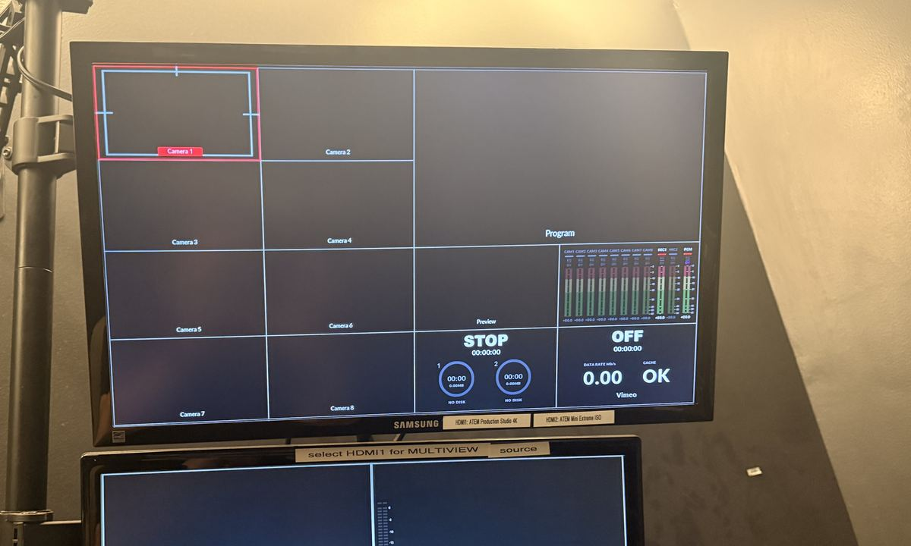

> 🧪 **Status: In Development.** Built from the instructor's *Salmon Checklist & S.O.P.* (last
> revised September 2025) plus corrections given in September 2026. **The audio chain in the SOP
> has already changed** — see **Technical verification** before you trust any audio step.

## 🎚️ Core skill area

**Video Capture**, **Audio Capture**, and **Data Management** — running a real recital recording
end to end, on gear that is already set up and must stay that way.

## 🌍 Why this matters

Every other activity in this course is practice. This one is the job.

A recital happens once. There is no second take, no "can we run that again", and no version of the
evening where you get to explain that the card was full. The engineer's entire value is that they
did the boring things in the right order, early, and then watched.

That is why this activity is a **checklist**, not a tutorial. The checklist exists because
somebody already made every mistake it prevents.

> 🛑 **This is a production room, not a practice room.** In the Portable Cameras activity you are
> encouraged to push settings around and see what breaks. Here you change only what the procedure
> names, and you put everything back. The desk is patched, routed, and set for live recitals that
> stream to an audience — a stray fader or a moved preset is not your experiment, it is somebody's
> concert. **If you are unsure whether you are allowed to change something, the answer is no.**

## 🎯 What you'll practice

- 📋 Work a real checklist under time pressure, in order, without skipping ahead.
- 🎥 Set up two independent recordings of the same concert so no single failure loses it.
- 🎚️ Get clean levels and verify them by listening, not by assuming.
- 💾 Get the files off the cards and onto two drives, named so somebody else can find them.
- 🤝 Hand the room back in the state you would want to find it.

## 🗝️ Key terms

**primary wide** · **backup wide** · **redundancy** · **program feed** · **multicam** ·
**switcher** · **board feed** · **Voice of God** · **preset** · **ISO recording** ·
**transcode** · slate · downbeat · encore

## 📍 Logistics

**Time:** a full gig. Arrive **90 minutes before downbeat** the first few times.

**Where:** the control room is **BH 208/209**; the hall is below. Printed checklists live in
**BH 208**. The door is on a key code — most students in this course have it. If yours does not
work, ask rather than propping the door.

**Group size:** one primary engineer signs for the work. A second person shadowing is ideal, and
is how you should do your first one.

## 🧰 Equipment and materials

- [ ] The **printed checklist** from BH 208 — take a fresh one, write on it
- [ ] The **AX100** and its stand, carried down to the hall (it lives in BH 208/209 storage)
- [ ] AC for the AX100, **plus a charged battery** as backup power
- [ ] A clean **SATA SSD** for the HyperDeck
- [ ] A clean **128 GB SD card** for the backup wide
- [ ] Small cards from the clear case: **8 GB** for the handheld recorder, **32 GB** for the Mac
- [ ] The program, once you can get hold of it

## ⚠️ Before you touch anything

- 🔌 **The battery backup under the desk feeds the iMac.** Its own label says it: holding that
  power button for two seconds enables or disables AC for everything on that circuit, and
  disabling it kills iMac power. Mid-concert that is not an inconvenience, it is the recording.
- 🏷️ **Read the labels.** Somebody has already taped down the answer to most questions you will
  have, including which HDMI feeds the multiview and which monitor shows the lobby.
- 🖥️ **There is more than one Mac in this room.** Check which machine you are on before you start
  clicking. They do different jobs.
- 🚫 **Do not adjust the audio preamps.** The gain structure is set. If something is too quiet,
  that is a conversation, not a knob.
- 🙋 **Ask.** The recital manager, the performer, and your supervisor all know things the
  checklist cannot. "Is there an encore?" has saved more recordings than any setting.

## 📐 The shape of the night

| Phase | What it is |
|---|---|
| **Pre-show** | Power, media, framing, levels. Most of the job, and all of the part you control. |
| **Doors** | Program, Voice of God, lobby feed. |
| **Show** | Start **three minutes early**, then watch. Check every 5–10 minutes. |
| **Intermission** | Pause everything together, swap media if needed, restart three minutes early. |
| **Post-show** | Power down, transfer to **two** drives, tidy, lights off. |
| **After** | Transcode, upload, email, keep the task board honest. |

🚩 **Checkpoint.** Before you power anything on, you have the printed checklist in your hand and a
pen. If you are doing this from memory you are already behind.

## 🎥 Two recordings, on purpose

A recital in Salmon is captured **twice**, by two chains that share nothing:

| | Primary | Backup |
|---|---|---|
| Camera | **AJA RovoCam**, installed in the hall | **Sony AX100** you carried down |
| Path | into the **ATEM** switcher | **nothing** — straight to its own card |
| Lands on | **SATA SSD** in the HyperDeck | **128 GB SD** in the camera |

The backup is deliberately kept off the switcher — the SOP says *"ensure that the HDMI is not
plugged into the ATEM Extreme"* — so that one dead disk, one pulled cable, or one wrong button
cannot take both copies with it.

**That is why the Portable Cameras drill matters.** The backup wide is a handheld camera that a
student sets by hand, and it is the copy that saves the evening when the main chain fails.

**Q1 (multiple choice).** Why is the backup wide deliberately *not* run through the switcher?

- a) The switcher has no spare inputs
- b) Its picture quality is too low to mix with the others
- ✅ c) So that a single failure in the switcher chain cannot destroy both recordings
- d) Because the AX100 cannot output HDMI

🚩 **Checkpoint.** Both chains have clean, empty media in them before the hall opens. "NO DISK" on
the multiview means exactly what it says.

## 📷 Framing and exposure

**The primary wide is framed, not exposed.** Zoom lives in **RovoControl** on the computer;
pan and tilt live on the **joystick**. The hall's lighting does not change from gig to gig, so
gain and f-stop are preset and the SOP tells you to leave them alone.

> 🚩 **The exception, and why you still need the stops.** Occasionally a piece is staged in low
> light — a candlelit set, a dimmed ballad. Rare, but it happens, and then the preset is wrong and
> **you** have to fix it in the moment. That is the entire point of the Portable Cameras drill:
> you should be able to say "that is two stops down, I will take one back on the iris and one on
> gain, and the gain will cost me noise in the shadows" without stopping to think. Deviate
> knowingly, note what you changed, and put it back afterwards.

**The shot itself**, for both cameras, is the same instruction and it is worth quoting exactly:
*"as close as possible, BUT wide enough to have enough space on edges while standing to bow."*
Performers stand up. They bow. They gesture at the accompanist. Frame for that, not for the
seated position you can see right now.

**Q2 (fill in the blank).** Write the framing rule in your own words, in one sentence, without
looking: ________________________________________________

✅ **Answer.** As tight as you can get while still leaving room at the edges for a performer
standing up and bowing.

The backup AX100 has its own settings for this hall:

| AX100 in Salmon | Value |
|---|---|
| Iris · gain · shutter | **F4 · 3 dB · 1/60** |
| White balance | **3800 K, A5 G2**, Soft High Key |
| Image size | **XAVC S 4K** |

**Q3 (multiple choice).** The Portable Cameras house default is 3200 K, and Salmon runs 3800 K.
Which is wrong?

- a) The house default — it should be updated to 3800 K
- b) Salmon — the cameras should match the house default
- ✅ c) Neither. The house default is a known state to return a camera to; 3800 K is what this
  particular hall's lights actually need
- d) Both, since white balance should always be set automatically

🚩 **Checkpoint.** Both cameras framed for a standing bow, and you can state each one's exposure
and white balance out loud without looking at the screen.

## 🎧 Sound

Audio is recorded on more than one device too, for the same reason the video is. There is a
multitrack capture on the recording Mac, a stereo handheld as the independent backup, and a
**board feed** from the mixer in the hall.

> ⚠️ **This part of the SOP is out of date and is being rewritten.** The multitrack front end has
> changed, and so has the handheld. Do not follow the audio steps from an old printed checklist
> without checking — see **Technical verification**. Ask before the gig, not during it.

What has not changed, and will not:

- **Listen before you trust it.** Headphones on, check both sides, check it is actually stereo and
  not the same signal twice.
- **Do not adjust the preamps.** If a level is wrong, fix it downstream or ask.
- **Record-enable everything and confirm you see meters moving** before the audience is in.

**Q4 (multiple choice).** You have signal, but both ears sound identical. What is the most likely
problem?

- a) The room is genuinely mono
- ✅ b) One of the two inputs is feeding both sides, or one XLR is in the wrong socket
- c) The headphones are broken
- d) The sample rate is wrong

🚩 **Checkpoint.** You have listened on headphones and confirmed clean, correct stereo — not
assumed it from a meter.

## 🎬 During the show

**Start every recording three minutes early.** Not at downbeat. Three minutes early, so that a
late start, a surprise introduction, or an early entrance is already captured.

Then the job changes from doing to **watching**:

- Check each recorder every **5–10 minutes**. Still running? Still has space?
- At intermission, **pause everything as close together as you can**, swap media if the second
  half will not fit, and start again three minutes early.
- If it is a multicam gig, adjust framing occasionally for variety — *"not adjust too much"*.

**Q5 (multiple choice).** Why start recording three minutes before downbeat?

- a) The recorders need time to reach full speed
- b) It makes the file sizes more consistent
- ✅ c) Because the evening can start earlier than you expect, and you cannot record the past
- d) It is required by the streaming platform

🚩 **Final checkpoint.** Every device that should be running is running, and you have personally
looked at each one since the last piece ended.

## ✅ Definition of done

- 🚩 The printed checklist is filled in and signed.
- 🚩 Two independent recordings of the full concert exist, both verified as playable.
- 🚩 Files copied into `YYMMDD [Concert Name]` folders on **both** the Post and Backup drives, raw
  in `from [SD CARD NAME]` subfolders.
- 🚩 Every piece of gear you turned on has been turned off, and nothing else has.
- 🚩 Gear you carried down is back in BH 208/209, and the lights are off.

## 💾 Afterwards

Getting it recorded is half the job. The SOP carries the rest — transcoding, Google Drive, email
confirmation, Panopto, and a task board — with deadlines of one week and three weeks. The naming
convention is not decoration: `YYMMDD [Concert Name]`, then `## [Piece Name]` for individual
movements, because somebody will look for this recording years from now.

🚩 **Checkpoint.** Cards are only wiped after the files exist in **two** places and you have
checked, by the "Triplets Triple Triple Checked" procedure.

## 🛠️ Troubleshooting

**IF a recorder shows NO DISK:** media is not inserted, not formatted, or not seated. Check before
the audience is in, never during.

**IF audio is silent:** confirm which Mac you are on, then work the chain backwards — monitoring,
outputs, record-enable, inputs, cables at the wall.

**IF the picture is too dark and it is a genuinely dark piece:** deviate knowingly. Say what you
are changing and by how many stops, change one thing, and write it down.

**IF you are unsure mid-show:** the recording that is already running is worth more than the fix
you are considering. Note the problem, keep the take rolling, ask afterwards.

## 🧹 Finish, reset, put away

1. Turn off the lobby feed.
2. Carry back anything you carried down.
3. Power down what you powered up — **and nothing else.**
4. Leave BH 208/209 tidy. Lights off.

## 💭 Before you leave

- What is the **one** step you would most easily forget if you ran this again without the paper?
- Which part of the night were you least confident about? That is the one to shadow again.

## ⚙️ Technical verification

**Last verified:** written September 2026 from the *Salmon Checklist & S.O.P.* dated September
2025, plus instructor corrections. The verbatim source is in
`content/activities/_source/bh209-salmon-sop.txt`. Confirm before treating any of this as
authoritative.

**Known to be out of date in the source SOP:**

- **The multitrack recorder has changed.** The SOP describes a MOTU 8PreX with fixed preamp
  positions into Logic; the room now uses a **Zoom F8**. Every audio step in the printed checklist
  needs rewriting around it — preamp positions, I/O settings, buffer size, and the Logic template
  may all be obsolete. **This activity deliberately does not give audio steps** until that lands.
- **The stereo handheld is probably now a Zoom H6**, not the H4n the SOP names. Unconfirmed. The
  input level, the XLR color convention, and the battery notes all need re-checking against
  whichever body is actually in the room.
- **The SOP names one Mac; there are several.** Which machine runs which job needs writing down,
  because "the computer in the room" is not an instruction.

**Still open:**

- Where Dante recording fits. One machine is named for it; the SOP never mentions it.
- Whether the livestream half of the SOP belongs in this activity, a second one, or neither.
- The step marked **"ATEM HyperDeck: INSTRUCTIONS COMING"** in the source — still coming.
- Photographs of the audio rack as it is now, which would settle most of the above faster than
  prose.

## 🤖 AI use disclosure

Assembled with AI assistance from the instructor's own Salmon Recital Hall checklist and S.O.P.,
the instructor's September 2026 corrections, and photographs of the room. The equipment facts,
the framing rule, and the redundancy design are the instructor's. The structure, the checkpoints,
the questions, and the troubleshooting order were AI-drafted and are pending instructor review.
Audio procedure is deliberately omitted rather than guessed, because the source is known stale.
